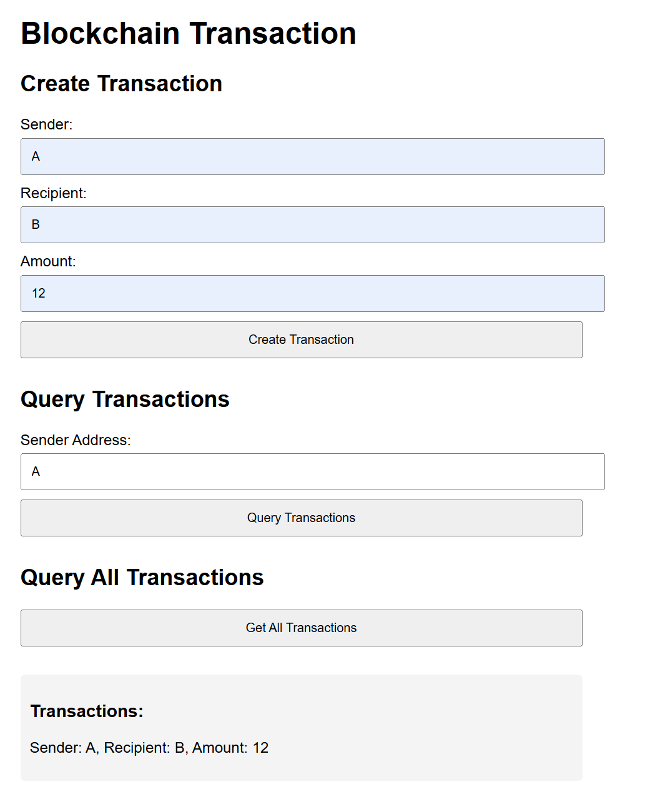

# 项目说明文档

## 项目概述

本项目是一个简单的区块链实现，展示了区块链的基本概念和功能，包括区块的创建、交易的打包、工作量证明（PoW）、区块链的维护以及网络通信。项目使用Go语言编写，代码结构清晰，适合初学者学习和理解区块链的基本原理。

## 功能模块

### 1. 区块（Block）
- **区块结构**：每个区块包含索引（Index）、时间戳（Timestamp）、数据（Data）、前一个区块的哈希（PrevHash）、当前区块的哈希（Hash）和随机数（Nonce）。
- **区块创建**：通过`NewBlock`函数创建新区块，并使用工作量证明算法计算区块的哈希。
- **创世区块**：通过`NewGenesisBlock`函数创建区块链的第一个区块（创世区块）。

### 2. 区块链（Blockchain）
- **区块链结构**：区块链由多个区块组成，存储在`Blocks`数组中。
- **区块链初始化**：通过`NewBlockchain`函数初始化一个新的区块链，并自动创建创世区块。
- **添加区块**：通过`AddBlock`函数将新区块添加到区块链中。

### 3. 工作量证明（Proof of Work, PoW）
- **PoW结构**：工作量证明算法通过`proofOfWork`结构实现，包含区块和目标值（target）。
- **PoW计算**：通过`Run`函数计算满足目标值的哈希值，并返回随机数（Nonce）和哈希值。
- **PoW验证**：通过`validate`函数验证区块的哈希值是否满足目标值。

### 4. 交易（Transaction）
- **交易结构**：每个交易包含发送者（Sender）、接收者（Recipient）和交易金额（Amount）。
- **交易池**：通过`TransactionPool`结构管理待处理的交易列表。
- **交易打包**：通过`MineBlock`函数将交易池中的交易打包到新区块中，并将新区块添加到区块链。

### 5. 网络（Network）
- **节点管理**：通过`Network`结构管理网络中的节点，支持节点的添加和区块的广播。
- **区块广播**：通过`BroadcastBlock`函数将新区块广播给网络中的所有节点。
- **服务器启动**：通过`StartServer`函数启动网络服务器，接收其他节点发送的区块并添加到区块链中。

### 6. HTTP服务器
- **区块查询**：通过`/blocks`接口查询区块链中的所有区块。
- **交易创建**：通过`/createTransaction`接口创建新的交易并添加到交易池中。
- **交易查询**：通过`/getTransaction`接口查询特定发送者的交易记录。
- **所有交易查询**：通过`/allTransactions`接口查询区块链中的所有交易。

### 7. 工具函数（Utils）
- **IntToHex**：将整数转换为字节数组，用于工作量证明算法中的数据准备。

## 实现过程

1. **区块创建**：通过`NewBlock`函数创建新区块，并使用工作量证明算法计算区块的哈希值。
2. **区块链初始化**：通过`NewBlockchain`函数初始化区块链，并创建创世区块。
3. **交易处理**：通过`TransactionPool`结构管理交易，并将交易打包到新区块中。
4. **工作量证明**：通过`proofOfWork`结构实现工作量证明算法，确保区块的哈希值满足目标值。
5. **区块链维护**：通过`AddBlock`函数将新区块添加到区块链中，并打印区块链信息。
6. **网络通信**：通过`Network`结构实现节点间的区块广播和同步。
7. **HTTP接口**：通过HTTP服务器提供区块和交易的查询、创建功能。

## 运行方法

1. **克隆项目**：

```bash
git clone https://github.com/ghostdoglzd/blockchain.git
cd blockchain
```

2. **运行项目**：

```bash
go run main.go
```

3. **访问Web界面**：
   - 打开浏览器，访问 `http://localhost:8081` 来使用Web界面创建和查询交易。

4. **输出示例**：



## 项目结构

```
D:.
│  go.mod
│  readme.md
│  result.png
│
└─blockchain
    │  main.go
    │
    └─blockchain
            blockchain.go
            proof.go
            transacation.go
            utils.go
            http_server.go
            network.go
            index.html
```

## 注意事项

- 确保在运行项目时，端口 `8080`、`8081` 和 `8082` 未被占用。
- 可以通过命令行参数添加其他节点的地址，例如：`go run main.go 127.0.0.1:8080`。
- 项目中的Web界面提供了简单的交易创建和查询功能，方便用户与区块链进行交互。
